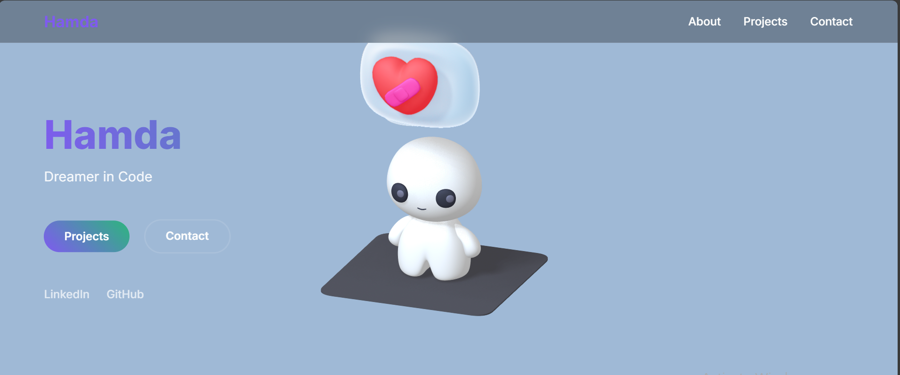

# 💡 Portfolio Experiment — Cute 

This project is **another experiment** in my ongoing journey of crafting a unique and interactive portfolio. With this build, I aimed to combine **animation**, **Spline 3D integration**, and **minimalistic UI** to create a visually engaging landing section for my developer profile.

---

## 🚀 Tech Stack & Tools

- **HTML5 & CSS3** — Markup and styling foundation
- **JavaScript (Vanilla)** — Typing animation logic and interaction
- **Spline 3D** — Integrated 3D model background (real-time web rendering)
- **Web Animations** — Floating text, shimmer gradient, and entry transitions
- **Google Fonts (Inter)** — Clean and modern typeface
- **Responsive Design** — Mobile and desktop compatible layout

---

## 🎯 Features

- 🔤 **Typing & deleting animated tagline**
- 🌈 **Colorful shimmering name/title effect**
- 🌀 **Spline 3D viewer embedded as interactive background**
- 🔘 **Interactive buttons & social links**
- 📱 **Fully responsive across devices**
- 🧪 **No frameworks or libraries used** (pure HTML, CSS & JS)

---

## 📽️ Demo Video

▶️ [Watch Demo Video](https://drive.google.com/file/d/122cAtu4p9uNG86i3DmD6bejjHYwsaa3J/view?usp=sharing)

---

